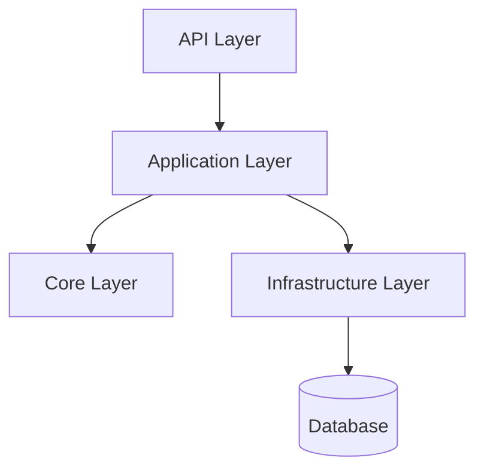

# Architecture



This project follows Clean Architecture principles:

- **Core**: Domain entities and interfaces (no dependencies)
- **Application**: Business logic, use cases, services
- **Infrastructure**: Data access (EF Core), external integrations
- **API**: ASP.NET Core Web API, DI, controllers

## Layered Dependencies
- API → Application → Core
- Infrastructure implements Core interfaces

## Project Structure
```
API-Design-Template/
  src/
    API.Design.Template.Core/
    API.Design.Template.Application/
    API.Design.Template.Infrastructure/
    API.Design.Template/
  tests/
  ci/
  docs/
``` 